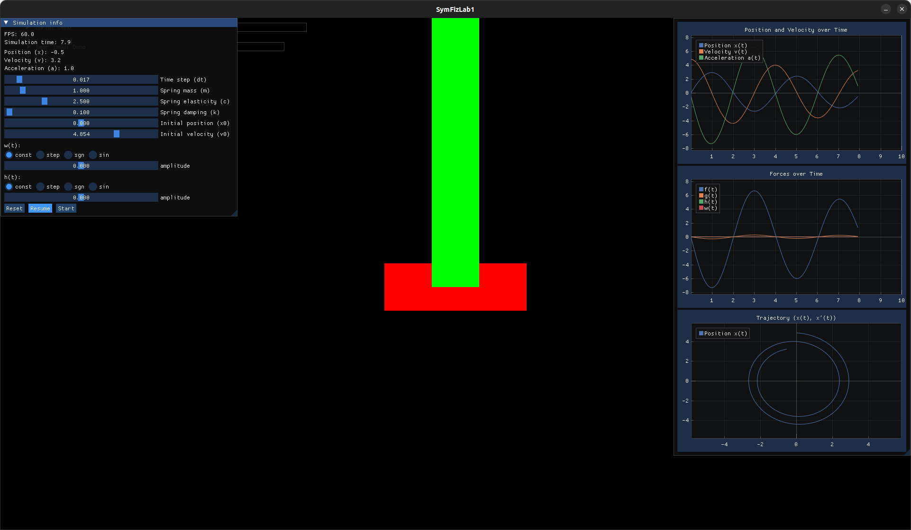

# SpringSimulation

### About

This is the first project created during "Physical simulations in a virtual
environment" course, specialty **CAD/CAM Systems Design** of degree in *Computer Science
and Information Systems* at *Warsaw University of Technology*.

The project utilizes Newton's equations to simulate movement of a mass placed on a spring.

### Build

The project is written in C++ using CMake as a build system and SDL2 for rendering.
In order to build it few development tools are needed:

- gcc and g++
- make
- cmake
- git

### Used Libraries

All used libraries are stored in `external` directory. `GLFW`, `ImGui`,`ImPlot` are
used as submodules.

| Library                                     | Licence                                                          |
|---------------------------------------------|------------------------------------------------------------------|
| [GLFW](https://github.com/glfw/glfw)        | [Zlib](https://github.com/glfw/glfw?tab=Zlib-1-ov-file#readme)   |
| [ImGui](https://github.com/ocornut/imgui)   | [MIT](https://github.com/ocornut/imgui?tab=MIT-1-ov-file#readme) |
| [ImPlot](https://github.com/epezent/implot) | [MIT](https://github.com/epezent/implot?tab=MIT-1-ov-file)       |

Currently, `GLM` isn't used as a submodule, therefore it has to be installed manually.